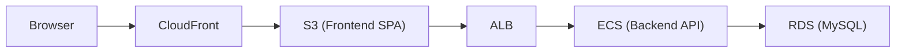
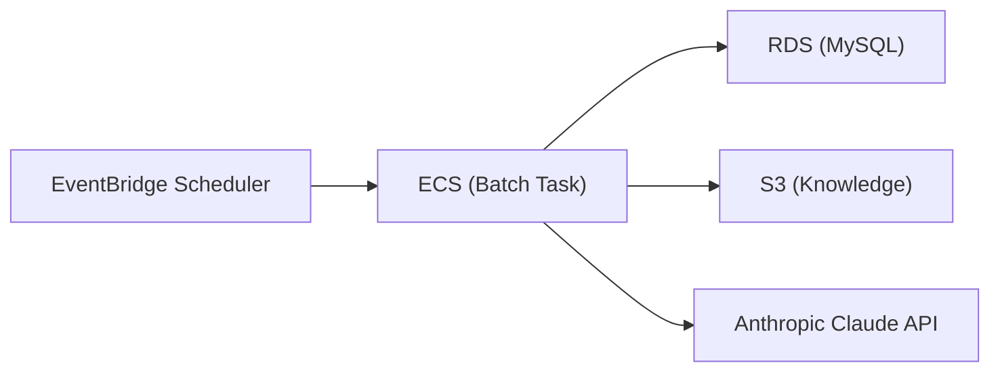
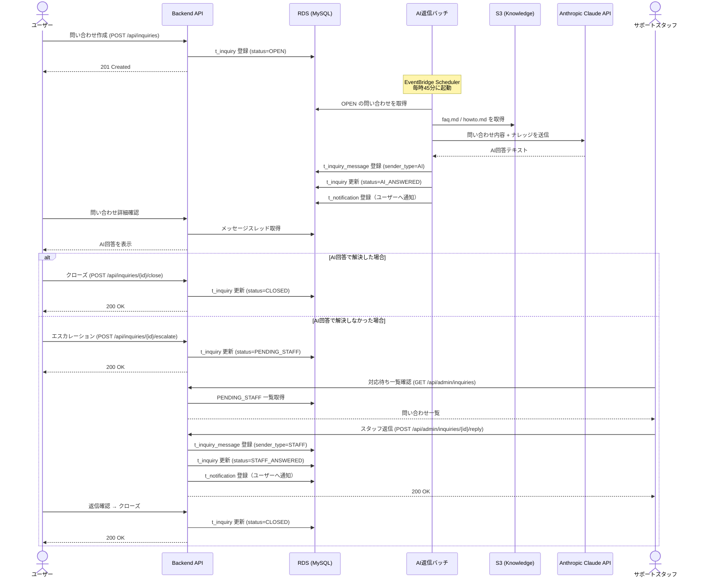
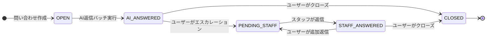
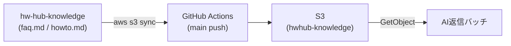
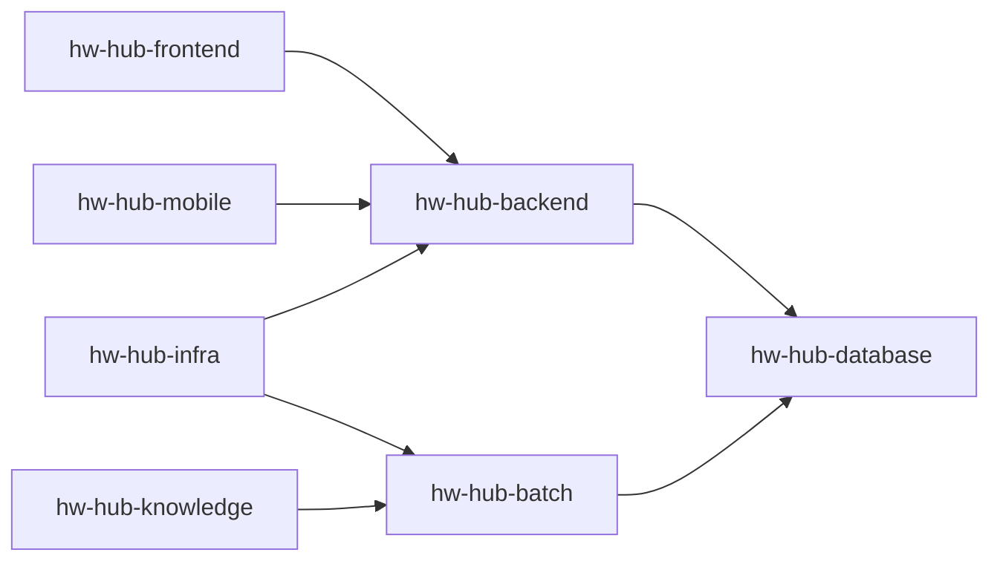
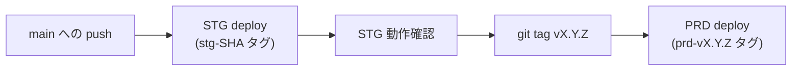
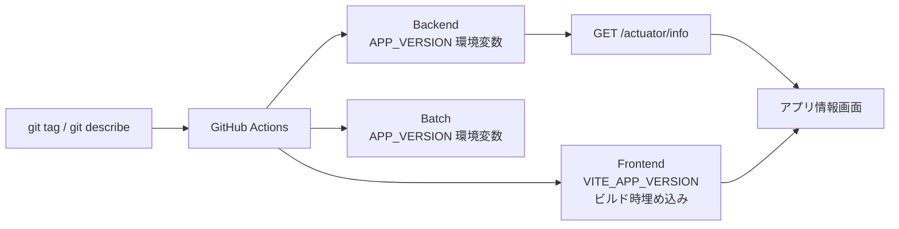

# Housework Hub (HwHub)


---

## Overview

Housework Hub（HwHub）は、家庭内の家事・買い物・メンバー管理を協調的に行うためのアプリケーションです。  
複数のおうち（Household）をサポートし、家事タスクのテンプレート化、定期実行、担当者割当、履歴管理などを提供します。  
ユーザーからの問い合わせには Claude API を活用した AI 自動返信機能を備えており、解決できない場合はサポートスタッフへのエスカレーションも可能です。

本リポジトリ群は以下の構成で成り立っています。

- **hw-hub-backend** : メインAPI（Spring Boot / MyBatis / MySQL）
- **hw-hub-batch** : 定期バッチ処理（Spring Batch / ECS Fargate）
- **hw-hub-frontend** : フロントエンド（Vue 3 + Vite + TypeScript）
- **hw-hub-mobile** : モバイルアプリ（Flutter / Riverpod / Dio）
- **hw-hub-database** : DBスキーマ・Flywayマイグレーション管理
- **hw-hub-infra** : AWSインフラ（Terraform）
- **hw-hub-knowledge** : AIサポートナレッジ（S3同期）

---

## Architecture

- Backend / Batch は AWS ECS Fargate 上で稼働
- DB は Amazon RDS (MySQL)
- ファイル保存は S3
- 認証は JWT
- フロントエンドは S3 + CloudFront によりホスティング
- バッチは EventBridge Scheduler により起動
- インフラは Terraform により管理
- STG 環境は Ephemeral 構成（使用時のみ `terraform apply`、不使用時は `terraform destroy`）

### High-level Flow

Online (Frontend + Backend)



Batch Processing



---

## Support Flow（問い合わせサポートフロー）

ユーザーが問い合わせを起票してからクローズするまでのフローです。  
AI による自動返信を一次対応とし、解決できない場合はサポートスタッフにエスカレーションします。  
ナレッジベースは `hw-hub-knowledge` リポジトリで管理し、main へのマージで S3 に自動同期されます。

### シーケンス図



### ステータス遷移



### ナレッジ管理フロー



---

## Tech stack

### Backend
- Java 21
- Spring Boot 4.0.x ※3.5.Xからバージョンアップ済み
- MyBatis + MyBatis Generator
- Flyway
- MySQL

### Frontend
- Vue 3 + Composition API
- TypeScript
- Pinia
- Tailwind CSS
- vue-i18n

### Mobile
- Flutter 3.x
- Dart 3.x
- Riverpod 2.x
- go_router 14.x
- Dio 5.x

### Infrastructure
- AWS ECS Fargate
- Application Load Balancer（Ephemeral）
- Amazon RDS (MySQL)
- Amazon S3
- CloudFront
- EventBridge Scheduler
- CloudWatch / SNS
- Route 53
- **Terraform**

---

## Repository Structure

| Repository | Role |
|------------------------------------------------------------------|-----------------------------|
| [hw-hub-backend](https://github.com/ryokkon624/hw-hub-backend)   | REST API / authentication / business logic |
| [hw-hub-batch](https://github.com/ryokkon624/hw-hub-batch)       | scheduled batch processing |
| [hw-hub-frontend](https://github.com/ryokkon624/hw-hub-frontend) | Web UI |
| [hw-hub-mobile](https://github.com/ryokkon624/hw-hub-mobile)     | iOS / Android mobile app |
| [hw-hub-database](https://github.com/ryokkon624/hw-hub-database) | Flyway database schema |
| [hw-hub-infra](https://github.com/ryokkon624/hw-hub-infra) | Terraform infrastructure |
| [hw-hub-knowledge](https://github.com/ryokkon624/hw-hub-knowledge) | AI support knowledge base (S3 sync) |

---

## Repository Relationship



---

## CI / CD 概要

GitHub Actions により CI/CD を構築しています。

main への push で以下を実行：

- テスト
- カバレッジ生成
- Docker build & push (ECR)
- ECS TaskDefinition 更新
- ECS Service / Scheduler 反映

---

## Coverage Report
- Backend: [GitHub Pages](https://ryokkon624.github.io/hw-hub-backend/)
- Batch: [GitHub Pages](https://ryokkon624.github.io/hw-hub-batch/)
- Frontend: [GitHub Pages](https://ryokkon624.github.io/hw-hub-frontend/)

---

## Infrastructure as Code

**Terraform** を使用しています。STG 環境は Ephemeral 構成で、使用時のみ起動します。

### Terraform 管理対象

- ALB / ALB Security Group / Listeners
- Target Group
- Route 53 A Record
- ECS Cluster / Service / Task Definition
- EventBridge Scheduler
- CloudWatch Log Groups / Alarms

### Terraform 管理外（data source 参照）

- RDS
- ACM Certificate
- CloudFront
- S3
- SNS
- VPC / Subnets

### STG 環境のコスト

| 状態 | 日次コスト（概算） |
|------|----------------|
| apply（起動中） | ~$5.71/日（大半がNATゲートウェイ） |
| destroy（停止中） | ~$0.09/日（RDS ストレージのみ） |

```bash
# 起動
terraform apply

# 停止
terraform destroy
```

---

## Local Development Setup

ローカル環境でアプリケーションを起動するための手順です。

### 前提条件

以下がインストールされていること。

- JDK 21
- Node.js 18+
- Docker / Docker Compose
- VS Code（推奨）または IntelliJ IDEA

---

### 1. リポジトリのクローン

```bash
# 各リポジトリを同一の親ディレクトリ配下にクローンすることを推奨
mkdir hw-hub
cd hw-hub

git clone https://github.com/ryokkon624/hw-hub-database.git
git clone https://github.com/ryokkon624/hw-hub-backend.git
git clone https://github.com/ryokkon624/hw-hub-frontend.git
# バッチを実行する場合
git clone https://github.com/ryokkon624/hw-hub-batch.git
# AI返信バッチを使う場合
git clone https://github.com/ryokkon624/hw-hub-knowledge.git
```

---

### 2. データベースの起動と初期化

```bash
cd hw-hub-database

# MySQL コンテナを起動
docker compose up -d

# Flyway マイグレーション実行
./gradlew flywayMigrate

# テストデータの投入
./gradlew seedDevData
```

---

### 3. AI 返信ナレッジのアップロード（オプション）

AI 返信バッチを動かす場合のみ必要です。

```bash
cd hw-hub-backend

# faq.md / howto.md を hw-hub-knowledge からコピー
cp ../hw-hub-knowledge/faq.md localstack/init/faq.md
cp ../hw-hub-knowledge/howto.md localstack/init/howto.md
```

LocalStack 起動時（手順4）に自動でアップロードされます。

---

### 4. Backend の環境設定

```bash
cd hw-hub-backend

# LocalStack（S3）・Mailhog（メール）を起動
docker compose up -d
```

プロジェクトルートに `.env` ファイルを作成してください。  
`.env.example` をコピーして必要な値を設定します。

```bash
cp .env.example .env
```

`.env` の設定内容（Google OAuth を使わない場合は値はそのままでOK）:

```env
GOOGLE_OAUTH_CLIENT_ID=          # Google OAuth を使う場合のみ
GOOGLE_OAUTH_CLIENT_SECRET=      # Google OAuth を使う場合のみ
HWHUB_OAUTH_STATE_SECRET=        # Google OAuth を使う場合のみ
```

VS Code の場合、`.vscode/launch.json` の `envFile` に `.env` を指定します。

```json
{
  "configurations": [
    {
      "type": "java",
      "name": "HwHub Backend",
      "envFile": "${workspaceFolder}/.env"
    }
  ]
}
```

---
### 5. Backend の起動

**VS Code の場合**

`実行とデバッグ` パネルから `HwHub Backend` を選択して起動。

**コマンドラインの場合**

```bash
cd hw-hub-backend
./gradlew bootRun
```

起動確認: `http://localhost:8080/actuator/health` が `{"status":"UP"}` を返すこと。

Swagger UI: `http://localhost:8080/swagger-ui/index.html`

---

### 6. Frontend の起動

```bash
cd hw-hub-frontend
npm install
npm run dev
```

ブラウザで `http://localhost:5173` にアクセス。

---

### 7. Mobile の起動（オプション）

iOS / Android モバイルアプリを動かす場合の手順です。Flutter SDK がインストールされていることが前提です。

```bash
cd hw-hub-mobile

# 依存パッケージ取得
flutter pub get

# アプリ起動（エミュレータ or 接続済み実機）
flutter run
```

> バックエンドの URL はデフォルト `http://10.0.2.2:8080`（Android エミュレータから見たホスト）。  
> 詳細は [mobile_README.md](https://github.com/ryokkon624/hw-hub-mobile/blob/main/mobile_README.md) を参照。

---

### 8. 動作確認（テストアカウント）

以下のテストアカウントでログインできます（パスワード共通: `admin`）。

| メールアドレス | 説明 |
|---|---|
| `home.owner@example.com` | 自宅オーナー（2世帯に所属） |
| `home.member@example.com` | 自宅メンバー |
| `parent.owner@example.com` | 実家オーナー |
| `parent.member1@example.com` 〜 `parent.member4@example.com` | 実家メンバー |

ユーザー間の詳細な関係性は `hw-hub-database/flyway/sql-test/R__test_household.sql` を参照。

管理画面へのアクセスには ADMIN または SUPPORT ロールが必要です。  
ロールの付与は管理画面（`/admin/roles`）またはデータベースの `m_user_role` テーブルから直接行ってください。

---

### 9. バッチの起動（オプション）

AI 返信バッチを動かす場合の追加手順です。

```bash
cd hw-hub-batch
cp .env.example .env
```

`.env` に Claude API キーを設定します。

```env
CLAUDE_API_KEY=your-claude-api-key
```

**VS Code の場合**

`.vscode/launch.json` に以下のように設定します。

```json
{
  "configurations": [
    {
      "type": "java",
      "name": "HwHub Batch",
      "envFile": "${workspaceFolder}/.env",
      "args": "--spring.batch.job.name=inquiryAiReplyJob"
    }
  ]
}
```

`実行とデバッグ` パネルから `HwHub Batch` を選択して起動。

**コマンドラインの場合**

```bash
./gradlew bootRun --args='--spring.batch.job.name=inquiryAiReplyJob'
```

---

### ローカル環境のサービス一覧

| サービス | URL | 用途 |
|---|---|---|
| Frontend | http://localhost:5173 | アプリ本体 |
| Backend API | http://localhost:8080 | REST API |
| Swagger UI | http://localhost:8080/swagger-ui/index.html | API ドキュメント |
| Mailhog | http://localhost:8025 | メール確認（メール認証が有効な場合） |
| LocalStack | http://localhost:4566 | S3 ローカルエミュレーター |

---

## Development

各リポジトリにそれぞれの詳細を記載したREADMEファイルがあります。

- [backend_README.md](https://github.com/ryokkon624/hw-hub-backend/blob/main/backend_README.md)
- [batch_README.md](https://github.com/ryokkon624/hw-hub-batch/blob/main/batch_README.md)
- [frontend_README.md](https://github.com/ryokkon624/hw-hub-frontend/blob/main/frontend_README.md)
- [mobile_README.md](https://github.com/ryokkon624/hw-hub-mobile/blob/main/mobile_README.md)
- [database_README.md](https://github.com/ryokkon624/hw-hub-database/blob/main/database_README.md)
- [infra_README.md](https://github.com/ryokkon624/hw-hub-infra/blob/main/infra_README.md)

---

## Versioning Strategy

HwHub は [Semantic Versioning](https://semver.org/) に基づいてバージョンを管理しています。

### バージョン形式

| 種別 | 形式 | 例 | 説明 |
|------|------|----|------|
| PRD リリース | `vMAJOR.MINOR.PATCH` | `v1.2.0` | git tag がそのままバージョンになる |
| STG ビルド | `vMAJOR.MINOR.PATCH-stg.N` | `v1.2.0-stg.3` | 直前のタグから N コミット後のビルド |
| ローカル開発 | `local` | `local` | 環境変数未設定時のデフォルト値 |

### バージョンアップルール

| 変更種別 | 上げるバージョン | 例 |
|----------|------------------|----|
| 破壊的変更（API非互換・DB大規模変更） | MAJOR | `v1.0.0` → `v2.0.0` |
| 機能追加（feature リリース） | MINOR | `v1.0.0` → `v1.1.0` |
| バグ修正のみ | PATCH | `v1.0.0` → `v1.0.1` |

### リリースフロー



### リポジトリ別バージョン管理

各リポジトリのタグは独立して管理されます。  
PATCH リリースではフロントエンドのみ・バックエンドのみのデプロイが発生するため、  
アプリ情報画面ではフロントとAPIのバージョンを個別に表示しています。

| リポジトリ | タグ管理 | CI/CDトリガー |
|------------|----------|---------------|
| hw-hub-frontend | 独立タグ | main push → STG / git tag → PRD |
| hw-hub-backend | 独立タグ | main push → STG / git tag → PRD |
| hw-hub-batch | 独立タグ | main push → STG / git tag → PRD |

### バージョン情報の伝搬



### ECR イメージタグ規則

| 環境 | タグ形式 | 例 |
|------|----------|----|
| STG（コミット単位） | `stg-${GITHUB_SHA}` | `stg-abc1234` |
| STG（最新） | `stg-latest` | `stg-latest` |
| PRD（バージョン単位） | `prd-vX.Y.Z` | `prd-v1.2.0` |
| PRD（最新） | `prd-latest` | `prd-latest` |

---

## Future Roadmap

Planned improvements:

- analytics dashboard

---

## Project Status

- architecture established
- CI/CD pipeline implemented
- AI-powered inquiry support implemented (Claude API)
- role-based admin panel implemented
- high test coverage achieved
- infrastructure managed via Terraform
- STG environment fully ephemeral (ALB / ECS / Route53 on demand)
